# Root Dependency Audit

Generated from a local crawl that starts at `index.html` and follows local HTML/CSS/JS references only.

## Summary

- Reachable local files from root crawl: `44`
- Isolated local files in repo scope: `35`
- Root-linked project entry pages: `7`

External URLs like Google Fonts, mailto links, and WhatsApp links are intentionally excluded from the local graph.

## Graph

```mermaid
flowchart TD
  n_byElie_cad_design_html["byElie/cad-design.html"] --> n_byElie_gallery_html["byElie/gallery.html"]
  n_byElie_cad_design_html["byElie/cad-design.html"] --> n_byElie_index_html["byElie/index.html"]
  n_byElie_cad_design_html["byElie/cad-design.html"] --> n_byElie_plans_html["byElie/plans.html"]
  n_byElie_cad_design_html["byElie/cad-design.html"] --> n_byElie_prints_html["byElie/prints.html"]
  n_byElie_cad_design_html["byElie/cad-design.html"] --> n_byElie_shared_css["byElie/shared.css"]
  n_byElie_cad_design_html["byElie/cad-design.html"] --> n_byElie_web_design_html["byElie/web-design.html"]
  n_byElie_gallery_html["byElie/gallery.html"] --> n_byElie_cad_design_html["byElie/cad-design.html"]
  n_byElie_gallery_html["byElie/gallery.html"] --> n_byElie_index_html["byElie/index.html"]
  n_byElie_gallery_html["byElie/gallery.html"] --> n_byElie_plans_html["byElie/plans.html"]
  n_byElie_gallery_html["byElie/gallery.html"] --> n_byElie_prints_html["byElie/prints.html"]
  n_byElie_gallery_html["byElie/gallery.html"] --> n_byElie_shared_css["byElie/shared.css"]
  n_byElie_gallery_html["byElie/gallery.html"] --> n_byElie_web_design_html["byElie/web-design.html"]
  n_byElie_index_html["byElie/index.html"] --> n_assets_logos_byelie_logo_png["assets/logos/byelie-logo.png"]
  n_byElie_index_html["byElie/index.html"] --> n_byElie_assets_elie_profile_nobg_png["byElie/assets/elie-profile-nobg.png"]
  n_byElie_index_html["byElie/index.html"] --> n_byElie_cad_design_html["byElie/cad-design.html"]
  n_byElie_index_html["byElie/index.html"] --> n_byElie_gallery_html["byElie/gallery.html"]
  n_byElie_index_html["byElie/index.html"] --> n_byElie_plans_html["byElie/plans.html"]
  n_byElie_index_html["byElie/index.html"] --> n_byElie_prints_html["byElie/prints.html"]
  n_byElie_index_html["byElie/index.html"] --> n_byElie_shared_css["byElie/shared.css"]
  n_byElie_index_html["byElie/index.html"] --> n_byElie_styles_css["byElie/styles.css"]
  n_byElie_index_html["byElie/index.html"] --> n_byElie_web_design_html["byElie/web-design.html"]
  n_byElie_plans_html["byElie/plans.html"] --> n_byElie_cad_design_html["byElie/cad-design.html"]
  n_byElie_plans_html["byElie/plans.html"] --> n_byElie_gallery_html["byElie/gallery.html"]
  n_byElie_plans_html["byElie/plans.html"] --> n_byElie_index_html["byElie/index.html"]
  n_byElie_plans_html["byElie/plans.html"] --> n_byElie_prints_html["byElie/prints.html"]
  n_byElie_plans_html["byElie/plans.html"] --> n_byElie_shared_css["byElie/shared.css"]
  n_byElie_plans_html["byElie/plans.html"] --> n_byElie_web_design_html["byElie/web-design.html"]
  n_byElie_prints_html["byElie/prints.html"] --> n_byElie_cad_design_html["byElie/cad-design.html"]
  n_byElie_prints_html["byElie/prints.html"] --> n_byElie_gallery_html["byElie/gallery.html"]
  n_byElie_prints_html["byElie/prints.html"] --> n_byElie_index_html["byElie/index.html"]
  n_byElie_prints_html["byElie/prints.html"] --> n_byElie_plans_html["byElie/plans.html"]
  n_byElie_prints_html["byElie/prints.html"] --> n_byElie_shared_css["byElie/shared.css"]
  n_byElie_prints_html["byElie/prints.html"] --> n_byElie_web_design_html["byElie/web-design.html"]
  n_byElie_web_design_html["byElie/web-design.html"] --> n_byElie_cad_design_html["byElie/cad-design.html"]
  n_byElie_web_design_html["byElie/web-design.html"] --> n_byElie_gallery_html["byElie/gallery.html"]
  n_byElie_web_design_html["byElie/web-design.html"] --> n_byElie_index_html["byElie/index.html"]
  n_byElie_web_design_html["byElie/web-design.html"] --> n_byElie_plans_html["byElie/plans.html"]
  n_byElie_web_design_html["byElie/web-design.html"] --> n_byElie_prints_html["byElie/prints.html"]
  n_byElie_web_design_html["byElie/web-design.html"] --> n_byElie_shared_css["byElie/shared.css"]
  n_conway_index_html["conway/index.html"] --> n_assets_logos_conway_logo_png["assets/logos/conway-logo.png"]
  n_index_html["index.html"] --> n_assets_logos_byelie_logo_png["assets/logos/byelie-logo.png"]
  n_index_html["index.html"] --> n_assets_logos_conway_logo_png["assets/logos/conway-logo.png"]
  n_index_html["index.html"] --> n_assets_logos_oleamedia_logo_png["assets/logos/oleamedia-logo.png"]
  n_index_html["index.html"] --> n_assets_logos_oleatax_logo_png["assets/logos/oleatax-logo.png"]
  n_index_html["index.html"] --> n_assets_logos_reversi_logo_png["assets/logos/reversi-logo.png"]
  n_index_html["index.html"] --> n_assets_logos_sorting_logo_png["assets/logos/sorting-logo.png"]
  n_index_html["index.html"] --> n_byElie_index_html["byElie/index.html"]
  n_index_html["index.html"] --> n_conway_index_html["conway/index.html"]
  n_index_html["index.html"] --> n_oleamediaco_index_html["oleamediaco/index.html"]
  n_index_html["index.html"] --> n_oleataxco_v25_index_html["oleataxco-v25/index.html"]
  n_index_html["index.html"] --> n_oleataxco_index_html["oleataxco/index.html"]
  n_index_html["index.html"] --> n_reversi_index_html["reversi/index.html"]
  n_index_html["index.html"] --> n_sortingalgos_index_html["sortingalgos/index.html"]
  n_oleamediaco_index_html["oleamediaco/index.html"] --> n_assets_logos_oleamedia_logo_png["assets/logos/oleamedia-logo.png"]
  n_oleamediaco_index_html["oleamediaco/index.html"] --> n_oleamediaco_OleaMediaCo_Oferta_ES_pdf["oleamediaco/OleaMediaCo-Oferta-ES.pdf"]
  n_oleamediaco_index_html["oleamediaco/index.html"] --> n_oleamediaco_OleaMediaCo_Offer_EN_pdf["oleamediaco/OleaMediaCo-Offer-EN.pdf"]
  n_oleamediaco_index_html["oleamediaco/index.html"] --> n_oleamediaco_OleaMediaCo_Offre_FR_pdf["oleamediaco/OleaMediaCo-Offre-FR.pdf"]
  n_oleamediaco_index_html["oleamediaco/index.html"] --> n_oleamediaco_theme_toggle_js["oleamediaco/theme-toggle.js"]
  n_oleamediaco_index_html["oleamediaco/index.html"] --> n_oleamediaco_v1_index_html["oleamediaco/v1/index.html"]
  n_oleamediaco_index_html["oleamediaco/index.html"] --> n_oleamediaco_v2_index_html["oleamediaco/v2/index.html"]
  n_oleamediaco_index_html["oleamediaco/index.html"] --> n_oleamediaco_v3_index_html["oleamediaco/v3/index.html"]
  n_oleamediaco_v1_index_html["oleamediaco/v1/index.html"] --> n_oleamediaco_assets_after_png["oleamediaco/assets/after.png"]
  n_oleamediaco_v1_index_html["oleamediaco/v1/index.html"] --> n_oleamediaco_assets_before_png["oleamediaco/assets/before.png"]
  n_oleamediaco_v1_index_html["oleamediaco/v1/index.html"] --> n_oleamediaco_before_after_slider_js["oleamediaco/before-after-slider.js"]
  n_oleamediaco_v1_index_html["oleamediaco/v1/index.html"] --> n_oleamediaco_index_html["oleamediaco/index.html"]
  n_oleamediaco_v1_index_html["oleamediaco/v1/index.html"] --> n_oleamediaco_theme_toggle_js["oleamediaco/theme-toggle.js"]
  n_oleamediaco_v1_index_html["oleamediaco/v1/index.html"] --> n_oleamediaco_v1_script_js["oleamediaco/v1/script.js"]
  n_oleamediaco_v1_index_html["oleamediaco/v1/index.html"] --> n_oleamediaco_v1_styles_css["oleamediaco/v1/styles.css"]
  n_oleamediaco_v1_index_html["oleamediaco/v1/index.html"] --> n_oleamediaco_v2_index_html["oleamediaco/v2/index.html"]
  n_oleamediaco_v1_index_html["oleamediaco/v1/index.html"] --> n_oleamediaco_v3_index_html["oleamediaco/v3/index.html"]
  n_oleamediaco_v1_index_html["oleamediaco/v1/index.html"] --> n_oleamediaco_variants_base_css["oleamediaco/variants-base.css"]
  n_oleamediaco_v1_styles_css["oleamediaco/v1/styles.css"] --> n_oleamediaco_assets_after_png["oleamediaco/assets/after.png"]
  n_oleamediaco_v1_styles_css["oleamediaco/v1/styles.css"] --> n_oleamediaco_assets_before_png["oleamediaco/assets/before.png"]
  n_oleamediaco_v2_index_html["oleamediaco/v2/index.html"] --> n_oleamediaco_assets_after_png["oleamediaco/assets/after.png"]
  n_oleamediaco_v2_index_html["oleamediaco/v2/index.html"] --> n_oleamediaco_assets_before_png["oleamediaco/assets/before.png"]
  n_oleamediaco_v2_index_html["oleamediaco/v2/index.html"] --> n_oleamediaco_before_after_slider_js["oleamediaco/before-after-slider.js"]
  n_oleamediaco_v2_index_html["oleamediaco/v2/index.html"] --> n_oleamediaco_index_html["oleamediaco/index.html"]
  n_oleamediaco_v2_index_html["oleamediaco/v2/index.html"] --> n_oleamediaco_shared_i18n_js["oleamediaco/shared-i18n.js"]
  n_oleamediaco_v2_index_html["oleamediaco/v2/index.html"] --> n_oleamediaco_shared_translations_js["oleamediaco/shared-translations.js"]
  n_oleamediaco_v2_index_html["oleamediaco/v2/index.html"] --> n_oleamediaco_theme_toggle_js["oleamediaco/theme-toggle.js"]
  n_oleamediaco_v2_index_html["oleamediaco/v2/index.html"] --> n_oleamediaco_v1_index_html["oleamediaco/v1/index.html"]
  n_oleamediaco_v2_index_html["oleamediaco/v2/index.html"] --> n_oleamediaco_v2_styles_css["oleamediaco/v2/styles.css"]
  n_oleamediaco_v2_index_html["oleamediaco/v2/index.html"] --> n_oleamediaco_v3_index_html["oleamediaco/v3/index.html"]
  n_oleamediaco_v2_index_html["oleamediaco/v2/index.html"] --> n_oleamediaco_variants_base_css["oleamediaco/variants-base.css"]
  n_oleamediaco_v2_styles_css["oleamediaco/v2/styles.css"] --> n_oleamediaco_assets_after_png["oleamediaco/assets/after.png"]
  n_oleamediaco_v2_styles_css["oleamediaco/v2/styles.css"] --> n_oleamediaco_assets_before_png["oleamediaco/assets/before.png"]
  n_oleamediaco_v3_index_html["oleamediaco/v3/index.html"] --> n_oleamediaco_assets_after_png["oleamediaco/assets/after.png"]
  n_oleamediaco_v3_index_html["oleamediaco/v3/index.html"] --> n_oleamediaco_assets_before_png["oleamediaco/assets/before.png"]
  n_oleamediaco_v3_index_html["oleamediaco/v3/index.html"] --> n_oleamediaco_before_after_slider_js["oleamediaco/before-after-slider.js"]
  n_oleamediaco_v3_index_html["oleamediaco/v3/index.html"] --> n_oleamediaco_index_html["oleamediaco/index.html"]
  n_oleamediaco_v3_index_html["oleamediaco/v3/index.html"] --> n_oleamediaco_shared_i18n_js["oleamediaco/shared-i18n.js"]
  n_oleamediaco_v3_index_html["oleamediaco/v3/index.html"] --> n_oleamediaco_shared_translations_js["oleamediaco/shared-translations.js"]
  n_oleamediaco_v3_index_html["oleamediaco/v3/index.html"] --> n_oleamediaco_theme_toggle_js["oleamediaco/theme-toggle.js"]
  n_oleamediaco_v3_index_html["oleamediaco/v3/index.html"] --> n_oleamediaco_v1_index_html["oleamediaco/v1/index.html"]
  n_oleamediaco_v3_index_html["oleamediaco/v3/index.html"] --> n_oleamediaco_v2_index_html["oleamediaco/v2/index.html"]
  n_oleamediaco_v3_index_html["oleamediaco/v3/index.html"] --> n_oleamediaco_v3_styles_css["oleamediaco/v3/styles.css"]
  n_oleamediaco_v3_index_html["oleamediaco/v3/index.html"] --> n_oleamediaco_variants_base_css["oleamediaco/variants-base.css"]
  n_oleamediaco_v3_styles_css["oleamediaco/v3/styles.css"] --> n_oleamediaco_assets_after_png["oleamediaco/assets/after.png"]
  n_oleamediaco_v3_styles_css["oleamediaco/v3/styles.css"] --> n_oleamediaco_assets_before_png["oleamediaco/assets/before.png"]
  n_oleataxco_v25_index_html["oleataxco-v25/index.html"] --> n_assets_logos_oleatax_logo_png["assets/logos/oleatax-logo.png"]
  n_oleataxco_index_html["oleataxco/index.html"] --> n_assets_logos_oleatax_logo_png["assets/logos/oleatax-logo.png"]
  n_oleataxco_index_html["oleataxco/index.html"] --> n_oleataxco_assets_Scalable_Tax_Planning_Pod_Model_pdf["oleataxco/assets/Scalable-Tax-Planning-Pod-Model.pdf"]
  n_oleataxco_index_html["oleataxco/index.html"] --> n_oleataxco_assets_Workload_and_Task_Justification_Model_pdf["oleataxco/assets/Workload-and-Task-Justification-Model.pdf"]
  n_oleataxco_index_html["oleataxco/index.html"] --> n_oleataxco_assets_kelly_portrait_jpg["oleataxco/assets/kelly-portrait.jpg"]
  n_oleataxco_index_html["oleataxco/index.html"] --> n_oleataxco_assets_styles_css["oleataxco/assets/styles.css"]
  n_oleataxco_index_html["oleataxco/index.html"] --> n_oleataxco_assets_theme_toggle_js["oleataxco/assets/theme-toggle.js"]
  n_reversi_index_html["reversi/index.html"] --> n_assets_logos_reversi_logo_png["assets/logos/reversi-logo.png"]
  n_sortingalgos_index_html["sortingalgos/index.html"] --> n_assets_logos_sorting_logo_png["assets/logos/sorting-logo.png"]
```

## Root Entry Points

- Root page: `index.html`
- Root-linked page: `byElie/index.html`
- Root-linked page: `conway/index.html`
- Root-linked page: `oleamediaco/index.html`
- Root-linked page: `oleataxco/index.html`
- Root-linked page: `oleataxco-v25/index.html`
- Root-linked page: `reversi/index.html`
- Root-linked page: `sortingalgos/index.html`
- Root-linked asset: `assets/logos/byelie-logo.png`
- Root-linked asset: `assets/logos/conway-logo.png`
- Root-linked asset: `assets/logos/oleamedia-logo.png`
- Root-linked asset: `assets/logos/oleatax-logo.png`
- Root-linked asset: `assets/logos/reversi-logo.png`
- Root-linked asset: `assets/logos/sorting-logo.png`

## Isolated Files

### Repo support files

Keep. These are repo-operational files, not site runtime files.

- `.gitignore`
- `AGENTS.md`
- `README.md`
- `oleamediaco/README.md`
- `oleamediaco/source/README.md`
- `oleataxco/README.md`

### Redirect pages not linked from the root site

Safe to archive if you do not rely on old direct URLs.

- `Codex/index.html`
- `OleaMedia/index.html`
- `OleaTax/index.html`
- `oleataxco/Codex/index.html`
- `oleataxco/OleaMedia/index.html`
- `oleataxco/OleaTax/index.html`

### Unused By Elie assets

Archive first. These look safe to remove from the live tree if no future page will use them.

- `byElie/assets/elie-profile.jpg`
- `byElie/assets/mock-elie.svg`

### Project docs and helper scripts

Keep. These are support files outside the live site graph.

- `docs/root-dependency-audit.md`
- `oleamediaco/PRD.md`
- `oleataxco/PRD.md`
- `oleataxco/content-workbook.md`
- `scripts/root_dependency_audit.py`

### Unlinked Olea Media root assets

Archive or delete after a quick visual grep check; they have no inbound links in the root crawl.

- `oleamediaco/script.js`
- `oleamediaco/styles.css`

### Source inputs and PDF tooling

Keep or move into a future `archive/source/` folder if you want a cleaner published tree.

- `oleamediaco/source/make_offer_pdfs.py`
- `oleamediaco/source/offer-sheet-en.html`
- `oleamediaco/source/offer-sheet-en.md`
- `oleamediaco/source/offer-sheet-es.html`
- `oleamediaco/source/offer-sheet-es.md`

### Unlinked Olea Media variants

Strong archive candidates. Nothing in the root crawl points to these variants.

- `oleamediaco/v4/index.html`
- `oleamediaco/v4/styles.css`
- `oleamediaco/v5/index.html`
- `oleamediaco/v5/styles.css`

### Unlinked Olea Tax v25 PDFs

Either add links from the page or archive them beside other v25 reference material.

- `oleataxco-v25/Scalable-Tax-Planning-Pod-Model.pdf`
- `oleataxco-v25/Workload-and-Task-Justification-Model.pdf`

### Legacy Olea Tax concept pages

Good archive candidates if the current Olea Tax homepage is the only intended live path.

- `oleataxco/concepts/01-trust-ledger.html`
- `oleataxco/concepts/02-modern-growth.html`
- `oleataxco/concepts/03-neighborhood-advisor.html`

