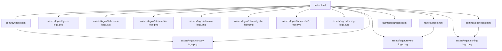

# Root Dependency Audit

Generated from a local crawl that starts at `index.html` and follows local HTML/CSS/JS references only.

## Summary

- Reachable local files from root crawl: `15`
- Isolated local files in repo scope: `8`
- Root-linked project entry pages: `4`

External URLs like Google Fonts, mailto links, and WhatsApp links are intentionally excluded from the local graph.
The `archive/` folder is also excluded so this report describes the live tree only.

## Graph

```mermaid
flowchart TD
  n_conway_index_html["conway/index.html"] --> n_assets_logos_conway_logo_png["assets/logos/conway-logo.png"]
  n_index_html["index.html"] --> n_assets_logos_byelie_logo_png["assets/logos/byelie-logo.png"]
  n_index_html["index.html"] --> n_assets_logos_conway_logo_png["assets/logos/conway-logo.png"]
  n_index_html["index.html"] --> n_assets_logos_deliveries_logo_svg["assets/logos/deliveries-logo.svg"]
  n_index_html["index.html"] --> n_assets_logos_oleamedia_logo_png["assets/logos/oleamedia-logo.png"]
  n_index_html["index.html"] --> n_assets_logos_oleatax_logo_png["assets/logos/oleatax-logo.png"]
  n_index_html["index.html"] --> n_assets_logos_photosbyelie_logo_png["assets/logos/photosbyelie-logo.png"]
  n_index_html["index.html"] --> n_assets_logos_reversi_logo_png["assets/logos/reversi-logo.png"]
  n_index_html["index.html"] --> n_assets_logos_sorting_logo_png["assets/logos/sorting-logo.png"]
  n_index_html["index.html"] --> n_assets_logos_tapmeplus1_logo_svg["assets/logos/tapmeplus1-logo.svg"]
  n_index_html["index.html"] --> n_assets_logos_trading_logo_svg["assets/logos/trading-logo.svg"]
  n_index_html["index.html"] --> n_conway_index_html["conway/index.html"]
  n_index_html["index.html"] --> n_reversi_index_html["reversi/index.html"]
  n_index_html["index.html"] --> n_sortingalgos_index_html["sortingalgos/index.html"]
  n_index_html["index.html"] --> n_tapmeplus1_index_html["tapmeplus1/index.html"]
  n_reversi_index_html["reversi/index.html"] --> n_assets_logos_reversi_logo_png["assets/logos/reversi-logo.png"]
  n_sortingalgos_index_html["sortingalgos/index.html"] --> n_assets_logos_sorting_logo_png["assets/logos/sorting-logo.png"]
```

## Root Entry Points

- Root page: `index.html`
- Root-linked page: `conway/index.html`
- Root-linked page: `reversi/index.html`
- Root-linked page: `sortingalgos/index.html`
- Root-linked page: `tapmeplus1/index.html`
- Root-linked asset: `assets/logos/byelie-logo.png`
- Root-linked asset: `assets/logos/conway-logo.png`
- Root-linked asset: `assets/logos/deliveries-logo.svg`
- Root-linked asset: `assets/logos/oleamedia-logo.png`
- Root-linked asset: `assets/logos/oleatax-logo.png`
- Root-linked asset: `assets/logos/photosbyelie-logo.png`
- Root-linked asset: `assets/logos/reversi-logo.png`
- Root-linked asset: `assets/logos/sorting-logo.png`
- Root-linked asset: `assets/logos/tapmeplus1-logo.svg`
- Root-linked asset: `assets/logos/trading-logo.svg`

## Isolated Files

### Repo support files

Keep. These are repo-operational files, not site runtime files.

- `.gitignore`
- `AGENTS.md`
- `README.md`

### Project docs and helper scripts

Keep. These are support files outside the live site graph.

- `CLAUDE.md`
- `SUMMARY.md`
- `TODO.md`
- `docs/root-dependency-audit.md`
- `scripts/root_dependency_audit.py`

